   * [Data Structures](README.md#data-structures)
   * [Linear Data Structures](README.md#linear-data-structures)
      * [Set](README.md#set)
      * [Map](README.md#map)
      * [Stack](README.md#stack)
      * [Queue](README.md#queue)
      * [Array](README.md#array)
      * [Linked List](README.md#linked-list)
      * [Hash Table](README.md#hash-table)
   * [Hierarchical Data Structures](README.md#hierarchical-data-structures)
      * [Tree](README.md#tree)
         * [Binary Search Tree (BST) ](README.md#binary-search-tree-bst)
         * [AVL Tree](README.md#avl-tree)
      * [Graphs](README.md#graphs)
         * [Real world applications of graphs](README.md#real-world-applications-of-graphs)
            * [Undirected Graph application ](README.md#undirected-graph-application)
               * [Social networking](README.md#social-networking)
            * [Directed Graph applications ](README.md#directed-graph-applications)
               * [World wide web](README.md#world-wide-web)
            * [Weighted vs Unweighted Graphs](README.md#weighted-vs-unweighted-graphs)
               * [Weighted](README.md#weighted)
               * [Unweighted](README.md#unweighted)
         * [Graph Algorithms](README.md#graph-algorithms)
            * [Depth First Search (DFS)](README.md#depth-first-search-dfs)
            * [Breadth First Search (BFS)](README.md#breadth-first-search-bfs)
   * [<strong>Additional Notes</strong>](README.md#additional-notes)
      * [Trie Data Structure](README.md#trie-data-structure)
      * [Heap Data Structure ](README.md#heap-data-structure)

# Data Structures

Picking a data structure for an implementation depends on the purpose. To decide which data structure fits best for your program, you have to consider several factors such as:

-   What kind of data needs to be stored ? Whether a _Tree_ or _Linked List_ or _Set_ or what would be ideal for storing your data.
-   What kind of operation needs to be done on this data ?. Is that _Push_ or _Pop_ or _Search_ etc. And, choose the best one that fits for your purpose.
-   What level of memory consumption is needed for operations on this data ?

# Linear Data Structures

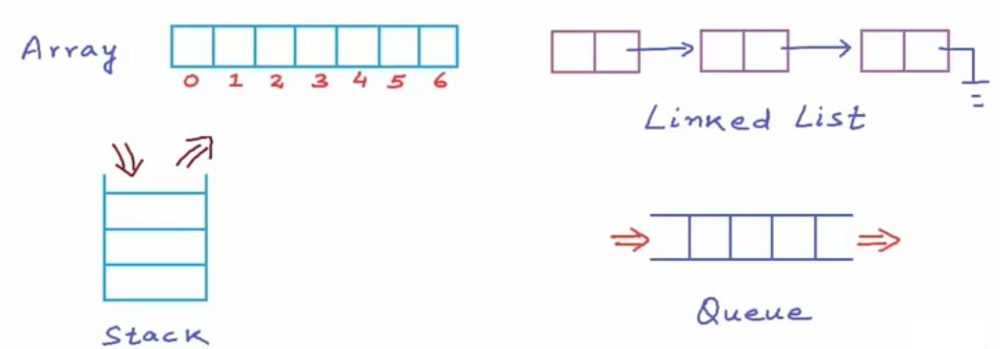  

## Set

-   There are **no duplicates**
-   There is no order of items. (Set introduced in ES 6 is ordered.)
    _Eg:_ An object has a **set** of properties. 

## Map

-   It is like **dictionary**
-   It could be imagined as a set of key value pairs.   
    _Eg:_ An object has a **map** of properties with values. **Arrays** are maps. ES 6 has map.

## Stack

-   **LIFO**
-   Push to top of stack, and Pop out from top itself
    _Eg:_ Arrays in Javascript is a stack implementation with **push** and **pop** available as array methods.

## Queue

-   **FIFO**
-   like a stream of video
-   Enqueue, Dequeue
    _Eg:_ Arrays in Javascript works as a queue with **push** and **shift** methods.

## Array

-   Best for get operation. Highly useless for delete.
-   Delete operations inside the array is very expensive because you have to reposition every other elements from the deleted position. Imagine if you had to delete 2nd element in an array of 10 million items ? You would have to reposition 9.99 million items. Thats ridiculously expensive. 
-   Hence, in such cases you could use linked list. Arrays are **best for quick get and set operations**, but **bad for deletions**.

## Linked List

-   Each item has a pointer to next item. There is head to point to the beginning of list and tail to point to the end of list.
-   **Super good for delete operations**. It only then need to change one pointer when its connection is deleted.
-   **Ridiculously expensive for get requests**. Because, if you have a 10 million items, you have to hop through all elements from the beginning to find the element you are searching for.
-   On contrast to array, linked list is better because shifting elements in memory during a delete operation in array is way more expensive than hopping through elements in a linked list to perform get operation (including a get operation to find an element for deletion.)

## Hash Table

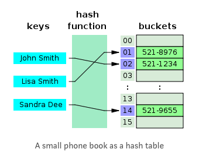  

-   Best data structure for **high performance** 
-   **O(1) is always guaranteed**
-   There is **no order**
-   Any data can be stored by first hashing the data to detect the key. When you search for a data, you just hash that data to determine the key, and you just pick that data from that key.
-   A good hash function gives collision free keys for different data
-   eg: In **PHP associative arrays are using hash tables behind the scenes**. But, PHP associative array is actually a superset of hash tables as they provide more features. You could even iterate a PHP associative array whereas a real hash table wouldn't provide that.     

# Hierarchical Data Structures

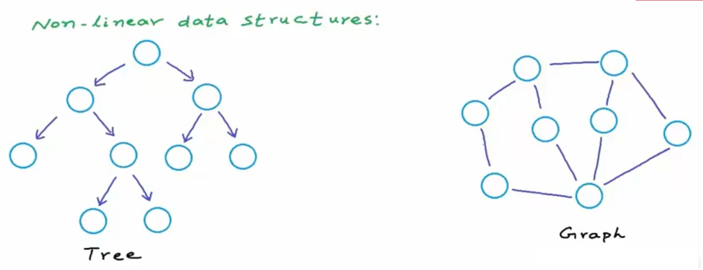  

## Tree

-   Best applications of tree would be:
    -   Storing naturally hierarchical data. 
        -   _Eg:_ File System
    -   Organise data for quick search, insertion, deletion etc. 
        -   _Eg:_ Binary Search Tree
    -   **Spell check while you type** a text, and other dictionary applications. **Trie** is the name for that tree implementation.
    -   Network routing algorithm.

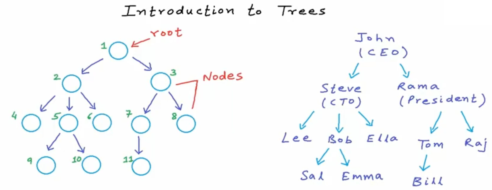  

### Binary Search Tree (BST) 

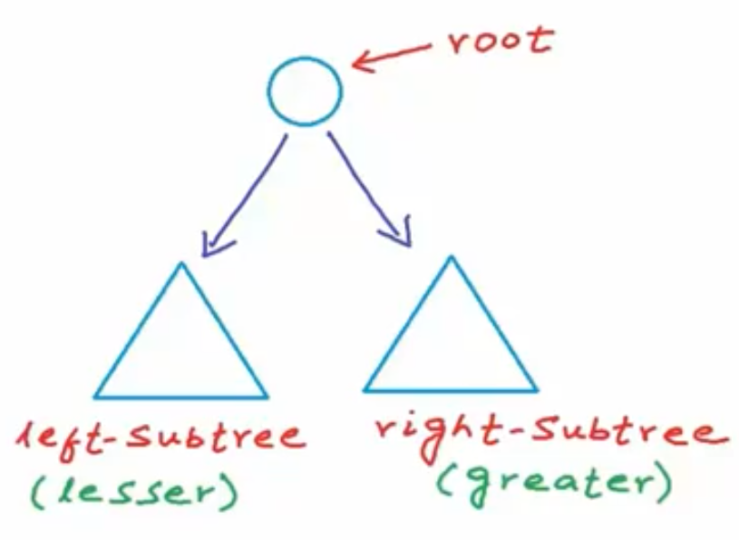  

A BST is a tree for storing ordered data which can have at most 2 children for each node, where

-   Right node is greater than root
-   Left node is lesser than root
-   But, in a case where you store only sorted numbers into the tree, if every elements align towards only one side in the incremental order, it would be inefficient. Hence, performance in that case is *O(n)*
-   A _perfect binary tree_ is one with all the nodes in a level are fully occupied. To find the number of nodes in a perfect binary tree, equation is 2(H+1)-1 
-   Most efficient because of logarithmic complexity. *O(log n)* for add or delete      
-   A binary search would reduce the search space into half in every step. Hence, the binary search function could search for a value in logarithmic complexity.

### AVL Tree

-   Binary search is quite good when its balanced. If not a balanced tree, binary search goes into its worst case scenario. 
-   To solve this problem by transforming a binary search tree into a balanced one is what AVL Tree is doing.
-   In worst case Binary Search can go O(n), but AVL Trees are always guaranteed to give O(log n)
-   Job of AVL Tree is to prevent a binary search tree from becoming what looks like the following unbalanced BST : 

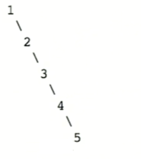  

## Graphs

-   Have vertices and edges
-   Directed and Undirected graphs
-   Tree is a kind of graph

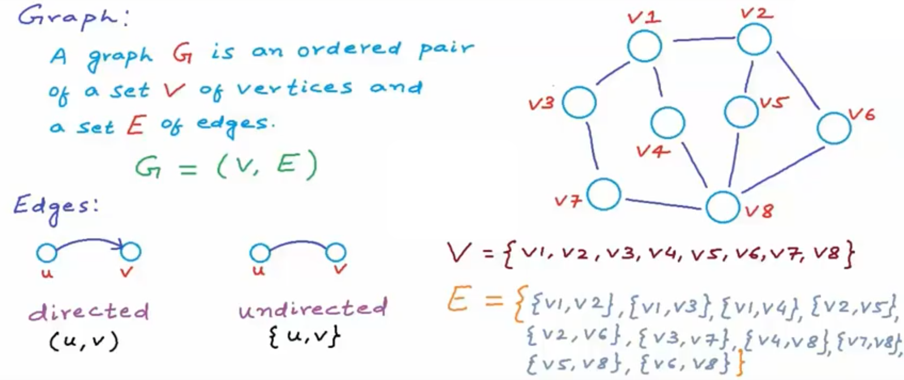  

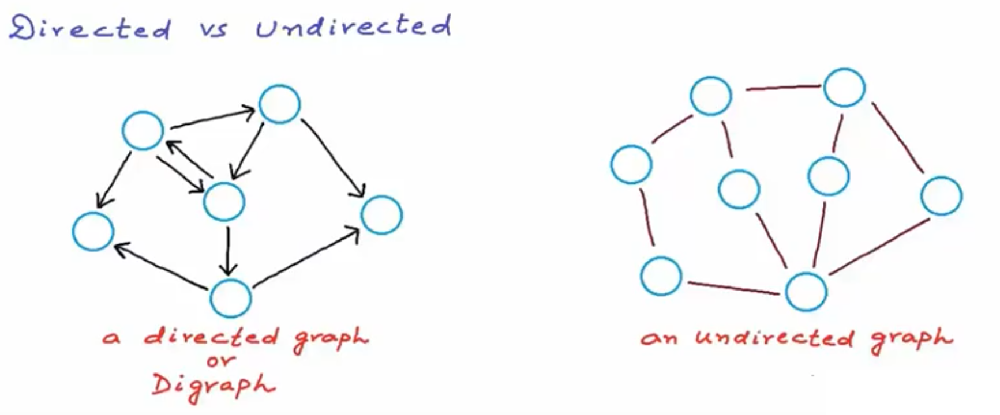  

### Real world applications of graphs

#### Undirected Graph application 

##### <u>Social networking</u>

-   In facebook friends are stored as graphs, undirected because if Rama is friend to Ella, Ella would of course be friend to Rama as well.
-   Friend suggestions can be done easily by looking for friends of friends who are not yet connected to me. In another words, it is like finding all nodes (friends) having length of shortest path from Rama equal to 2.
-   Mapping real world applications to a known data structure makes it easy to plot existing algorithms for different use cases. 

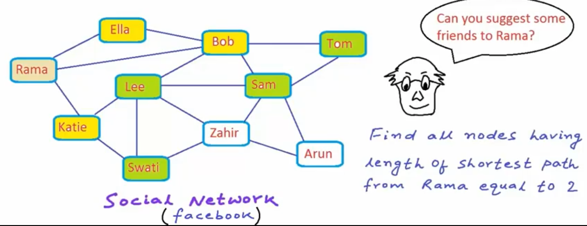  
  
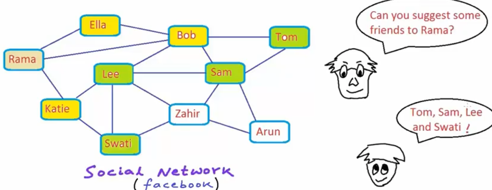 

#### Directed Graph applications 

##### <u>World wide web</u>

-   World wide web is a network of interlinked pages. Here, one page links to another doesn't mean there is a return back linking. Hence this is directed graph.
-   Search engines uses this property of graph for web crawling as it is simply graph traversal .

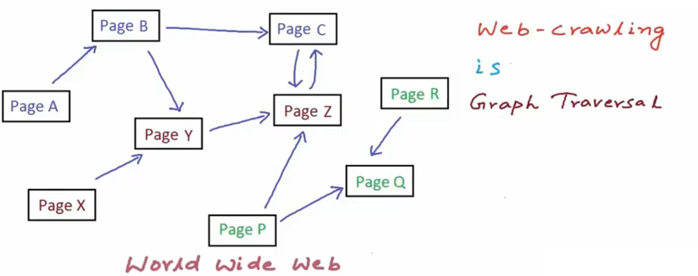 

#### Weighted vs Unweighted Graphs

-   Weighted graphs has some unit of weight for each edge (for eg: length in KM)
-   Unweighted graphs are those for which every edges have same weight

##### <u>Weighted</u>

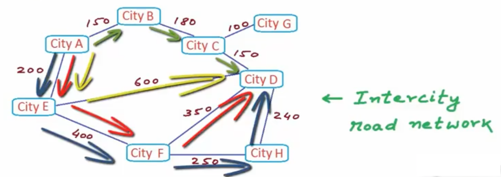 

##### <u>Unweighted</u>

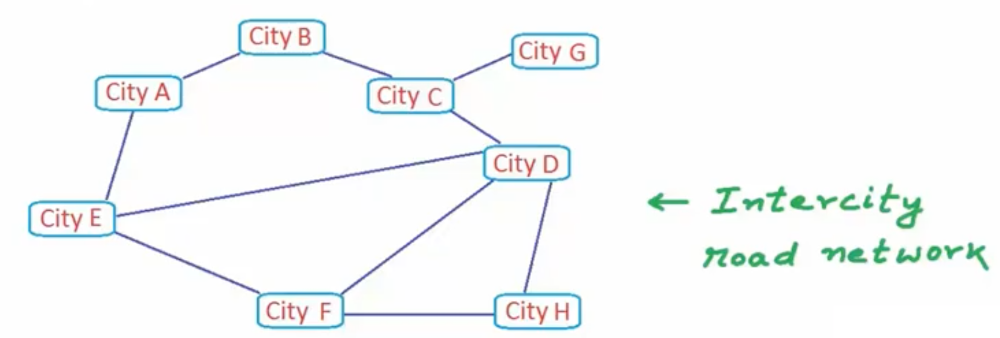 

### Graph Algorithms

#### Depth First Search (DFS)

Data structure used here is **Stack**

#### Breadth First Search (BFS)

Data structure used here is **Queue**

# **Additional Notes**

## Trie Data Structure

This data structure is used to look up words while you type to perform spell check. So when you type each character it searches in trie data structure whether that much typed characters actually is part of a word character sequence.

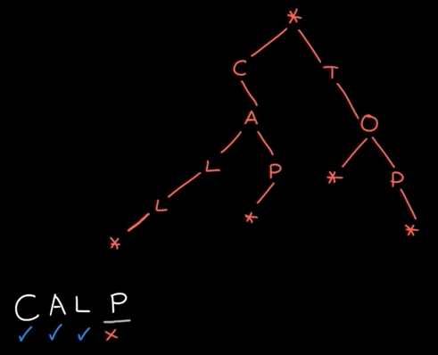  

## Heap Data Structure 

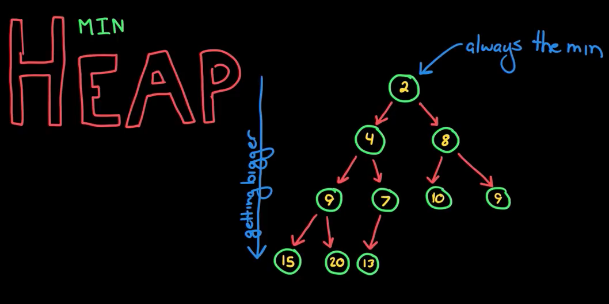   
